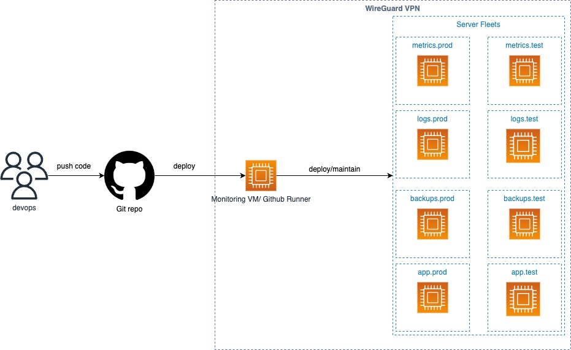

# README #

Status Infra Assignment

## What is this repository for? ##

- Status Infra Assignment

### Architecture
Assuming we have a Monitoring VM (Or Github Runner) for controlling other VM, and it's in the same VPN with other fleets
|  |
|:--:|
| <b>Thanos Architecture</b>|
* Deploy application to the monitoring server or Run application from the Github Runner
* Trigger app when ever we have new IP address

### Ways to improve or other solutions
* Implement Logging for this app
* Try to use terraform iptables provider [Terraform Iptables Provider](https://registry.terraform.io/providers/jeremmfr/iptables/latest/docs)
* Using chef to control iptables rules